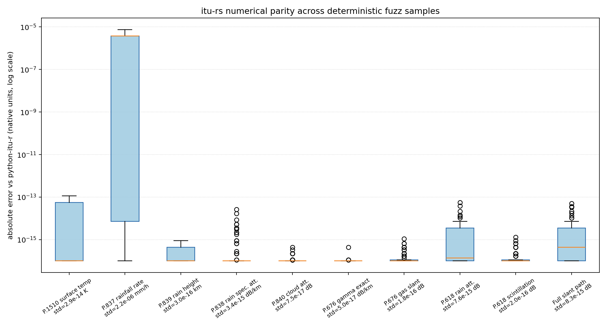

# itu-rs

[](https://github.com/Fierthraix/itu-rs/actions/workflows/ci.yml)
[](https://crates.io/crates/itu-rs)
[](https://crates.io/crates/itu-rs)
[](https://docs.rs/itu-rs)
[](LICENSE)

`itu-rs` is a Rust implementation of selected [ITU-R P-series](https://www.itu.int/rec/R-REC-p)
atmospheric propagation routines, ported from
[`python-itu-r`](https://github.com/inigodelportillo/ITU-Rpy) for Earth-space slant-path attenuation
calculations that run 30-50x faster than the Python implementation in benchmarked workloads.

- [Data Files](#data-files)
  - [Automatic Data Download](#automatic-data-download)
  - [Git Repo Checkout](#git-repo-checkout)
  - [Manual Data Directory](#manual-data-directory)
- [Python Package](#python-package)
- [Example](#example)
- [Supported Coverage](#supported-coverage)
- [Benchmarks](#benchmarks)
- [API](#api)
- [Attribution](#attribution)

## Data Files

`itu-rs` requires [ITU-R](https://www.itu.int/pub/R-REC) data grids, which are too large to include directly because crates.io limits uploaded `.crate` archive size.
The preferred way to automatically get the data files is by enabling the [`data` feature](#automatic-data-download).

### Automatic Data Download

For published-package use, enable the `data` feature:

```toml
[dependencies]
itu-rs = { version = "1", features = ["data"] }
```

With `features = ["data"]`, no runtime configuration is required: the build
uses local `data/` files when present, otherwise downloads and embeds the
verified data archive.

### Git Repo Checkout
The working repository checkout includes the required [ITU-R](https://www.itu.int/pub/R-REC) grids under
`itu-rs/data`, so local development is self-contained.

### Manual Data Directory

If you do not want automatic data download, set `ITU_RS_DATA_DIR` to a directory
containing the same `itur/data` layout copied from
[`python-itu-r`](https://github.com/inigodelportillo/ITU-Rpy).

Unix shells:

```sh
export ITU_RS_DATA_DIR=/path/to/ITU-Rpy/itur/data
```

Windows PowerShell:

```powershell
$env:ITU_RS_DATA_DIR = "C:\path\to\ITU-Rpy\itur\data"
```

## Python Package

`itu-rs` is also available as an optional Python package backed by the same Rust
implementation:

```sh
uv add itu-rs
# or: pip install itu-rs
```

Python imports use an underscore because Python module names cannot contain
hyphens:

```python
import itu_rs

attenuation = itu_rs.atmospheric_attenuation_slant_path(
    45.4215,
    -75.6972,
    12.0,
    30.0,
    0.1,
    1.2,
)

print(f"{attenuation.total_db:.6f} dB")
```

Published wheels embed the ITU-R data grids, so normal Python installs do not
require `ITU_RS_DATA_DIR`.

For local Python binding development, use `uv`:

```sh
uv run --project python --group dev maturin develop --manifest-path python/Cargo.toml
uv run --project python --group dev pytest python/tests
```

## Example

Compute the full atmospheric attenuation contribution set for one Earth-space
slant path:

```rust
use itu_rs::{atmospheric_attenuation_slant_path, SlantPathOptions};

fn main() -> Result<(), Box<dyn std::error::Error>> {
    let attenuation = atmospheric_attenuation_slant_path(
        45.4215,   // latitude, degrees
        -75.6972,  // longitude, degrees
        12.0,      // frequency, GHz
        30.0,      // elevation, degrees
        0.1,       // time percentage
        1.2,       // antenna diameter, m
        SlantPathOptions::default(),
    )?;

    println!("{:.6} dB", attenuation.total_db);
    Ok(())
}
```

Sweep multiple elevation angles for one fixed site and link configuration:

```rust
use itu_rs::{atmospheric_attenuation_slant_path_many, SlantPathOptions};

fn main() -> Result<(), Box<dyn std::error::Error>> {
    let elevations = [5.0, 17.5, 45.0, 89.0];
    let attenuation = atmospheric_attenuation_slant_path_many(
        45.4215,
        -75.6972,
        12.0,
        &elevations,
        0.1,
        1.2,
        SlantPathOptions::default(),
    )?;

    for (elevation, result) in elevations.iter().zip(attenuation.iter()) {
        println!("{elevation:5.1} deg: {:.6} dB", result.total_db);
    }

    Ok(())
}
```

Use exact gaseous attenuation or disable individual components through
`SlantPathOptions`:

```rust
use itu_rs::{atmospheric_attenuation_slant_path, SlantPathOptions};

fn main() -> Result<(), Box<dyn std::error::Error>> {
    let options = SlantPathOptions {
        exact: true,
        include_rain: false,
        include_clouds: false,
        ..SlantPathOptions::default()
    };

    let attenuation = atmospheric_attenuation_slant_path(
        10.0, 20.0, 18.0, 17.5, 0.7, 0.8, options,
    )?;

    println!("gas + scintillation: {:.6} dB", attenuation.total_db);
    Ok(())
}
```

Use recommendation helper APIs directly when only one part of the propagation
model is needed:

```rust
use itu_rs::{rainfall_rate_mmh, surface_month_mean_temperature_k, zero_isotherm_height_km};

fn main() -> Result<(), Box<dyn std::error::Error>> {
    let lat = 45.4215;
    let lon = -75.6972;

    let january_temp_k = surface_month_mean_temperature_k(lat, lon, 1)?;
    let rain_rate_mmh = rainfall_rate_mmh(lat, lon, 0.1)?;
    let h0_km = zero_isotherm_height_km(lat, lon)?;

    println!("{january_temp_k:.2} K, {rain_rate_mmh:.2} mm/h, {h0_km:.2} km");
    Ok(())
}
```

## Supported Coverage

| [`python-itu-r`](https://github.com/inigodelportillo/ITU-Rpy) function or feature |  | Status |
|---|---:|---|
| `itur.atmospheric_attenuation_slant_path` | ✅ | Public API |
| Batched slant-path attenuation over elevation angles | ✅ | Public API |
| Gas-only default slant-path attenuation helper | ✅ | Public API |
| [P.676](https://www.itu.int/rec/R-REC-P.676) gaseous attenuation, exact and approximate slant, terrestrial, and inclined paths | ✅ | Public scalar APIs |
| [P.618](https://www.itu.int/rec/R-REC-P.618) rain attenuation, rain probability, diversity, XPD, and lognormal fit helpers | ✅ | Public scalar APIs |
| [P.618](https://www.itu.int/rec/R-REC-P.618) scintillation attenuation contribution | ✅ | Public scalar APIs |
| [P.840](https://www.itu.int/rec/R-REC-P.840) cloud attenuation contribution and lognormal approximation | ✅ | Public scalar APIs |
| [P.1511](https://www.itu.int/rec/R-REC-P.1511) topographic altitude lookup | ✅ | Public scalar API |
| [P.1510](https://www.itu.int/rec/R-REC-P.1510) annual and monthly surface mean temperature lookup | ✅ | Public scalar APIs |
| [P.836](https://www.itu.int/rec/R-REC-P.836) water vapour density and total content lookup | ✅ | Public scalar APIs |
| [P.837](https://www.itu.int/rec/R-REC-P.837) rainfall probability, rainfall rate, and inverse rainfall-rate lookup | ✅ | Public scalar APIs |
| [P.839](https://www.itu.int/rec/R-REC-P.839) zero-isotherm and rain height lookup | ✅ | Public scalar APIs |
| [P.453](https://www.itu.int/rec/R-REC-P.453) refractivity, vapour pressure, and refractivity-gradient lookup | ✅ | Public scalar APIs |
| [P.678](https://www.itu.int/rec/R-REC-P.678) inter-annual variability and exceedance risk | ✅ | Public scalar APIs |
| [P.835](https://www.itu.int/rec/R-REC-P.835) reference atmosphere | ✅ | Public scalar APIs |
| [P.838](https://www.itu.int/rec/R-REC-P.838) rain specific attenuation | ✅ | Public scalar APIs |
| [P.1144](https://www.itu.int/rec/R-REC-P.1144) regular-grid interpolation helper APIs | ✅ | Public scalar APIs |
| [P.530](https://www.itu.int/rec/R-REC-P.530) terrestrial line-of-sight paths | ❌ | Not implemented |
| [P.1623](https://www.itu.int/rec/R-REC-P.1623) fade duration, fade slope, and fade depth | ❌ | Not implemented |
| [P.1853](https://www.itu.int/rec/R-REC-P.1853) tropospheric impairment time-series synthesis | ❌ | Not implemented |

## Benchmarks

The current comparison benchmark was run from the source workspace on
May 8, 2026 using the existing Python parity harness against
[`python-itu-r`](https://github.com/inigodelportillo/ITU-Rpy) and
the Rust port. Results are means over repeated runs.

| Scenario | Python mean | Rust mean | Speedup | Max absolute error |
|---|---:|---:|---:|---:|
| Batched default slant path, 4 locations x 169 elevations | `0.195419 s` | `0.005600 s` | `34.89x` | `7.105e-15 dB` |
| Exact scalar slant path with explicit overrides | `0.140981 s` | `0.002637 s` | `53.46x` | `0.000e+00 dB` |



Run the Rust-only Criterion benchmarks with:

```sh
cargo bench
```

## API

The primary public calls are:

| Function | Purpose |
|---|---|
| `atmospheric_attenuation_slant_path` | Compute gas, cloud, rain, scintillation, and total attenuation for one elevation angle. |
| `atmospheric_attenuation_slant_path_many` | Compute the same contribution set for many elevation angles. |
| `gas_attenuation_default` | Compute gas-only default attenuation for one elevation angle. |
| `gas_attenuation_default_many` | Compute gas-only default attenuation for many elevation angles. |
| `gas_attenuation_default_many_checked` | Compatibility alias for strict gas-only batch validation. |

Additional scalar APIs expose the implemented recommendation pieces directly:

| Recommendation | Public functions |
|---|---|
| [P.1510](https://www.itu.int/rec/R-REC-P.1510)/[P.1511](https://www.itu.int/rec/R-REC-P.1511) | `surface_mean_temperature_k`, `surface_month_mean_temperature_k`, `topographic_altitude_km` |
| [P.835](https://www.itu.int/rec/R-REC-P.835) | `standard_temperature_k`, `standard_pressure_hpa`, `standard_water_vapour_density_gm3` |
| [P.836](https://www.itu.int/rec/R-REC-P.836)/[P.837](https://www.itu.int/rec/R-REC-P.837)/[P.839](https://www.itu.int/rec/R-REC-P.839) | `surface_water_vapour_density_gm3`, `total_water_vapour_content_kgm2`, `rainfall_probability_percent`, `rainfall_rate_r001_mmh`, `rainfall_rate_mmh`, `unavailability_from_rainfall_rate_percent`, `zero_isotherm_height_km`, `rain_height_km` |
| [P.838](https://www.itu.int/rec/R-REC-P.838) | `rain_specific_attenuation_coefficients`, `rain_specific_attenuation_db_per_km` |
| [P.840](https://www.itu.int/rec/R-REC-P.840) | `cloud_reduced_liquid_kgm2`, `cloud_liquid_mass_absorption_coefficient`, `cloud_specific_attenuation_coefficient`, `cloud_attenuation_db`, `lognormal_approximation_coefficients`, `cloud_attenuation_lognormal_db` |
| [P.453](https://www.itu.int/rec/R-REC-P.453) | `wet_term_radio_refractivity`, `dry_term_radio_refractivity`, `radio_refractive_index`, `water_vapour_pressure_hpa`, `saturation_vapour_pressure_hpa`, `map_wet_term_radio_refractivity`, `dn65`, `dn1` |
| [P.678](https://www.itu.int/rec/R-REC-P.678) | `inter_annual_variability`, `risk_of_exceedance` |
| [P.676](https://www.itu.int/rec/R-REC-P.676) | `gamma0_exact_db_per_km`, `gammaw_exact_db_per_km`, `gamma_exact_db_per_km`, `gamma0_approx_db_per_km`, `gammaw_approx_db_per_km`, `slant_inclined_path_equivalent_height_km`, `zenith_water_vapour_attenuation_db`, `gaseous_attenuation_slant_path_db`, `gaseous_attenuation_terrestrial_path_db`, `gaseous_attenuation_inclined_path_db` |
| [P.618](https://www.itu.int/rec/R-REC-P.618) | `rain_attenuation_db`, `rain_attenuation_probability_percent`, `fit_rain_attenuation_to_lognormal`, `site_diversity_rain_outage_probability_percent`, `rain_cross_polarization_discrimination_db`, `scintillation_sigma_db`, `scintillation_attenuation_db` |
| [P.1144](https://www.itu.int/rec/R-REC-P.1144) | `is_regular_grid`, `nearest_2d_interpolate`, `bilinear_2d_interpolate`, `bicubic_2d_interpolate` |

`SlantPathOptions::default()` matches the default slant-path configuration used
by the port. Set `exact = true` to use exact gaseous attenuation.

## Attribution

This crate contains a Rust port of selected functionality from
[`python-itu-r`](https://github.com/inigodelportillo/ITU-Rpy), which is MIT licensed. See `NOTICE.md`.
